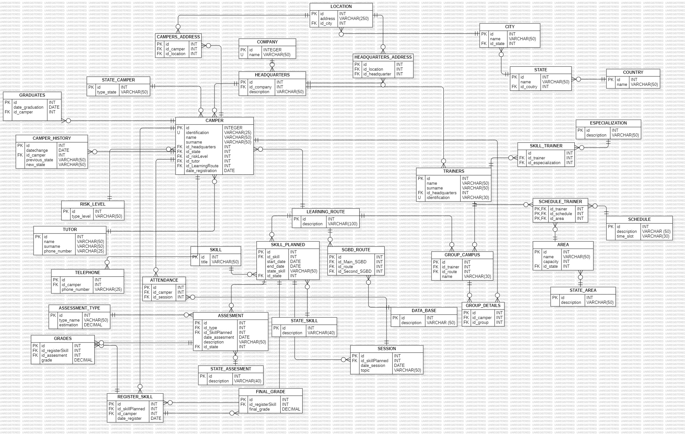

# Modelo Base de Datos
Teniendo en cuenta, la problemática planteada se desarrolló el siguiente modelo ER para la creación de la base de datos.

La base de datos se compone de algunas entidades tales como:
- **Company**: Hace referencia a la empresa o institución educativa en este caso Campuslands.
- **Headquarters**: Sedes de las institución educativa.
- **Camper**: Hace referencia a los estudiantes que se encuentran en el campus, en esta se relacionan entidades como: nivel de riesgo, estado, sede a la cual pertenece, historial de los estados, acudiente, número de teléfono, ruta de aprendizaje asignada, dirección, asistencias.
- **Trainer**: Hace referencia a los profesores que se encuentran en el campus, en esta se relacionan entidades como: sede a la cual pertenece, habilidades técnicas, horario, grupo asignado, área de entrenamiento.
- **Learning Route**: En esta se tienen las rutas de aprendizaje que se asignarán al camper, esta tiene entidades que se relacionan como:
    - **Skills**: Modulos que se pueden impartir en las rutas de aprendizaje.
    - **Skill Planned**: Modulos que se programan en determinada ruta de aprendizaje.
    - **Data Base**: Bases de datos que se pueden relacionar a la ruta de aprendizaje.
    - **SGDB Route**: Se especifica la base de datos principal y la alternativa.
    - **Sessions**: De acuerdo al modulo programado se tiene las sesiones programadas para el skill, así mismo se relaciona con la asistencia de los Campers.
- **Assesment**: Las evaluaciones se relacionan con el modulo programado, además se identifica el tipo de evaluación.
- **Assesment_type**: Se define el tipo de evaluación y la ponderación evaluación teórica (30%), práctica (60%), y trabajos/quizzes (10%).
- **Grades**: Calificación de la evaluación
- **Register_Skill**: En esta se matricula el camper a los modulos, obteniendo la nota final de cada skill.
